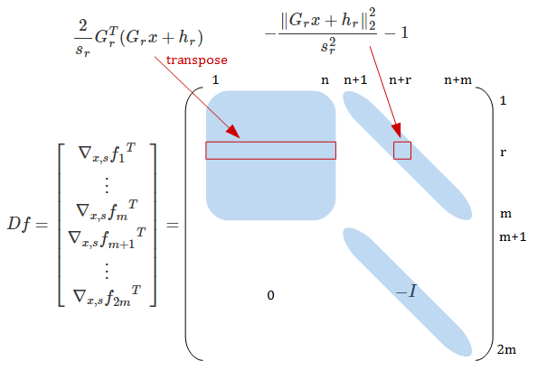
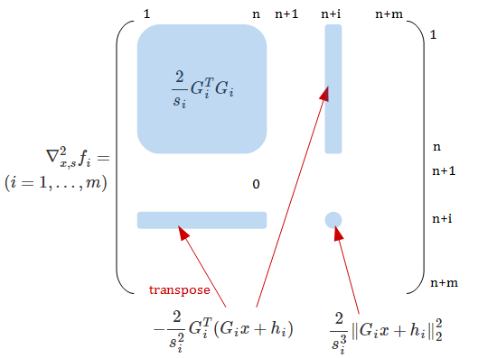

# SOCP

二次錐計画問題(second-order cone program)を扱います。

## 問題定義

変数 $$ x \in {\bf R}^n $$ に対して

$$
\begin{array}{ll}
{\rm minimize}     & f^T x \\
{\rm subject \ to} & ||G_i x + h_i||_2 \le c_i^T x + d_i, \quad i = 1, \ldots, m \\
                   & Ax = b
\end{array}
$$

* $$ f \in {\bf R}^n $$　
* $$ G_i \in {\bf R}^{n_i \times n}, \ h_i \in {\bf R}^{n_i}, \ c_i \in {\bf R}^n, \ d_i \in {\bf R} $$　
* $$ A \in {\bf R}^{p \times n}, \ b \in {\bf R}^p $$　
  * $$ {\bf rank} \ A = p < n $$　

次で示すように、[QCQP](QCQP)を特殊ケースとして含むことがわかります。
したがって、二次計画問題(QP)、最小二乗問題(LS)、線形計画問題(LP)も特殊ケースとして含みます。

### SOCPで二次目的関数

$$
\begin{array}{ll}
{\rm minimize}     & {1\over2} x^T P x + q^T x + r
\end{array}
$$

は変数 $$t$$ を追加して

$$
\begin{array}{ll}
{\rm minimize}_{x, t} & t \\
{\rm subject \ to}    & {1\over2} x^T P x + q^T x + r \le t
\end{array}
$$

と表すことができるので、SOCPで二次制約関数を表現できればよいです。

### SOCPで二次制約関数

$$ {1\over2} x^T P x + q^T x + r \le 0 $$
は $$P$$ が正定値であれば
$$ {1\over2} \|P^{1/2} x + P^{-1/2} q\|_2^2 \le {1\over2} q^T P q - r $$
とできるので、平方根をとってSOCPで表現できます。

$$P$$ が半正定値の場合は、正則になるように両辺に $$(c^T x + d)^2$$ を加えて、
$$ {1\over2} x^T P x + q^T x + r + (c^T x + d)^2 \le (c^T x + d)^2 $$
の左辺が $$ \|\cdots\|_2^2 $$ となるように
$$c, d$$ を決める必要がありそうです（自信なし・・・SVDすればいいのかも？）。

理屈上はQCQPなどがSOCPの特殊ケースであるとはいえ、
実用上SOCPソルバで解こうとして変換するのは面倒だったり無駄が多かったりしそうです。

## （cone programmingでない）[主双対内点法](PrimalDualIPM)の適用

### 制約の変形

上の定義のままだと、不等式制約の導関数が扱いにくい（ $$G_i x + h_i = 0$$ となる $$x$$ で微分不可能）ので、置き換えます。

$$
\begin{array}{rcl}
  ||G_i x + h_i||_2 \le (c_i^T x + d_i)
  &\iff& ||G_i x + h_i||_2^2 \le (c_i^T x + d_i)^2,
         \quad c_i^T x + d_i \ge 0  \\
  &\Longleftarrow& {||G_i x + h_i||_2^2 \over c_i^T x + d_i} \le c_i^T x + d_i,
         \quad c_i^T x + d_i \gt 0  \\
  &\Longleftarrow& {||G_i x + h_i||_2^2 \over c_i^T x + d_i} \le c_i^T x + d_i,
         \quad c_i^T x + d_i \ge \epsilon_{\rm bd}
\end{array}
$$

最初の変形は単に両辺二乗ですが、これだと制約関数が非凸になり得ます。
二番目の変形で（ $$c_i^T x + d_i > 0$$ の下で）凸になりますが、
$$c_i^T x + d_i = 0$$ の境界のぶんだけ除外されてしまうので、等価な変形ではありません。
最後に、除外する境界に幅をもたせて、許容値としてパラメータ $$\epsilon_{\rm bd} > 0$$ で表すことにします。

完全に等価な変形ではありませんが、
任意の誤差 $$\epsilon_{\rm bd}$$ の範囲で準最適な解を求めることは可能です。

さらに、変数 $$ s \in {\bf R}^m $$ を追加して、

$$
\begin{array}{l}
 {||G_i x + h_i||_2^2 \over s_i} \le s_i \\
 s_i \ge \epsilon_{\rm bd} \\
 c_i^T x + d_i = s_i
\end{array}
$$

とします。
任意の $$x$$ の初期値に対して $$ s_i > ||G_i x + h_i||_2 + \epsilon_{\rm bd} $$ となるように
$$ s $$ の初期値を決めることにより、
[Phase I via infeasible start](PrimalDualIPM)と同様に実行可能でない点から開始することができます。

### 目的関数・制約関数とその導関数

$$
\begin{array}{rcl}
f_0 &=& f^T x \\
f_i &=& \left\{ \begin{array}{ll}
        {||G_i x + h_i||_2^2 \over s_i} - s_i, & (i = 1, \ldots, m) \\
        \epsilon_{\rm bd} - s_{i-m}, & (i = m + 1, \ldots, 2m)
        \end{array} \right.
\end{array}
$$

目的関数の導関数は

$$
\begin{array}{rcl}
\nabla_{x, s} f_0   &=&
  \left[ \begin{array}{c}
  f \\ 0
  \end{array} \right] \\
\nabla_{x, s}^2 f_0 &=& 0
\end{array}
$$

です。
不等式制約関数の導関数はややこしいので図にしてみます：

$$ i = m + 1, \ldots, 2m $$ では $$ \nabla_{x,s}^2 f_i = 0 $$ です。

等式制約は

$$
\left[ \begin{array}{cc}
  A & 0 \\
  \begin{array}{c}
  c_1^T \\ \vdots \\ c_m^T
  \end{array} & -I_{m \times m}
\end{array} \right] =
\left[ \begin{array}{c}
  b \\
  \begin{array}{c}
  -d_1 \\ \vdots \\ -d_m
  \end{array}
\end{array} \right]
$$

と置き換えます。

## ソースコード

[主双対内点法](PrimalDualIPM)参照
