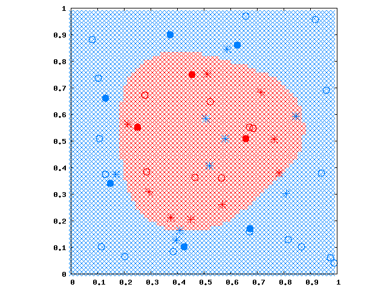

# ソフトマージンSVM

## 動機

[ハードマージンSVM](SVM) では、データがきれいに分割されている場合しか考えていませんでしたが、実際の問題では、ノイズがあったりでデータの分布がオーバーラップしていることも往々にしてあります。
この場合、正確な分離面を構築するのが無理だったり、できたとしても無意味に複雑な分離面になってしまう可能性があります。

そこでソフトマージンSVMでは、ハードマージンの制約を緩めて、マージン（分離面に一番近いデータ点と分離面との距離）を最大にしなかったり、分離に失敗するデータ点があったりすることを許します。

## 考え方

個々のデータ点に対し「ハードマージン制約の緩まり具合」を表すなんらかの変数を \(\xi_i\) （スラック変数と呼ばれる）として、 \(\frac12w^2\) の最小化（マージン最大化）と一緒に最小化することを考えます。

ここで、「最小化の際に \(\xi\) をどのくらい大きいまま残していいか」は問題によって変わるので、外部からパラメータ \(C\) として与えられるとします。
つまり
\[
\text{ minimize } \frac12w^2 + C\sum_i\xi_i
\]
を行います。
\(C\) が小さければ \(\xi\) は大きくとれるので、よりソフトな分離になります。
\(C\) が大きければよりハードな分離になり、\(C\rightarrow\infty\) ではハードマージンSVMと等価になります。

制約条件のほうは、
$$
\begin{array}{ll}
y_i(wx_i+b) \ge 1-\xi_i \\
\xi_i \ge 0
\end{array}
$$
とします。
\(\xi_i=0\) のときはハードマージンです。
\(0<\xi_i<1\) のときは、正しく分離されていますが、より小さいマージン（ソフトマージン）をとることがわかります。
そして \(\xi_i \ge 1\) のときは、分離ミスを許している状況です。

## 主問題と双対問題

上記をまとめて、主問題は
$$
\text{ find } w, b \text{ s.t. }
\begin{array}{ll}
\text{ minimize }
& \frac12w^2 + C\sum_i\xi_i \\
\text{ subject to }
& y_i(wx_i+b) \ge 1-\xi_i, \ \xi_i \ge 0
\end{array}
$$
と書けます。

双対問題もハードマージンSVMと同じやり方で求まります。
まずはラグランジュ乗数を \(\alpha,\beta\) として、一般ラグランジアン
\[
L = \frac12w^2+C\sum_i\xi_i +
    \sum_i\alpha_i(1-\xi_i-y_i(wx_i+b)) +
    \sum_i\beta_i(-\xi_i)
\]
を得ます。
そして \( {\partial L \over \partial w}=0,{\partial L \over \partial b}=0,{\partial L \over \partial \xi}=0 \) で得られる関係をラグランジアンに再度代入してまとめると、双対問題
$$
\text{ find } \alpha \text{ s.t. }
\begin{array}{ll}
\text{ maximize}
& \sum_i\alpha_i - \frac12\sum_{i,j}\alpha_i\alpha_jy_iy_jK(x_i,x_j) \\
\text{ subject to }
& \sum_i\alpha_iy_i=0, \ C \ge \alpha_i \ge 0
\end{array}
$$
を得ます（カーネルの適用も同時に行いました）。
不思議なことに \(\xi,\beta\) は一切消えてハードマージンとほぼ同じになります。
違うのは \(C\ge\alpha_i\) が要求されることだけです。

## SMOアルゴリズムの適応とサンプルコード

ハードマージンSVMの場合の [SMOアルゴリズム](SMO) から、乗数更新結果のクリッピング範囲だけを変えるだけです。
\(y_n=y_m\) のとき \([\max(0,\alpha_m+\alpha_n-C),\min(C,\alpha_m+\alpha_n)]\) で、\(y_n=-y_m\) のとき \([\max(0,\alpha_m-\alpha_n),\min(C,C+\alpha_m-\alpha_n)]\) となります。

バイアス \(b\) の途中計算も少し変える必要があると思います。
というのも、KKT条件から \(\alpha_i=C\) ならば \(\xi_i\ge0\) で、\(y_i(wx_i+b)<1\) となりうるからです。
\[
b = - \ {\max_{i|y_i=-1,0<\alpha_i<C} wx_i + \min_{i|y_i=+1,0<\alpha_i<C} wx_i \over 2}
\]
とします。

ソースコードは [ここ](https://github.com/convexbrain/studynotes/tree/master/sandbox/SVM/softmargin) にあるようになります。
[SMOアルゴリズム](SMO) と同じサンプルデータを使って、 \(C=10\) で学習すると次図のようになります。

＊印は \(\alpha_i=C\) の点です。
ドーナツの穴のようになっていた部分はノイズとみなされ、分離面はシンプルなものになりました。
ただし \(\alpha_i=0\) でない点が多くなり、SVMの特徴であったスパース性が失われてるように見えます。

また \(C\) というハイパーパラメータをどうやって決めるかという課題もあります。
まぁこれをいうならカーネル選択やカーネル関数のパラメータ（たとえばガウシアンの \(\sigma\) ）も同じ話ですけど。
しかしこれはSVMに始まった話ではないですね。
AICやMDLといったモデル選択基準を使う方法や、交差検定という手法が知られています。
