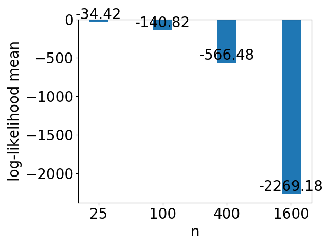
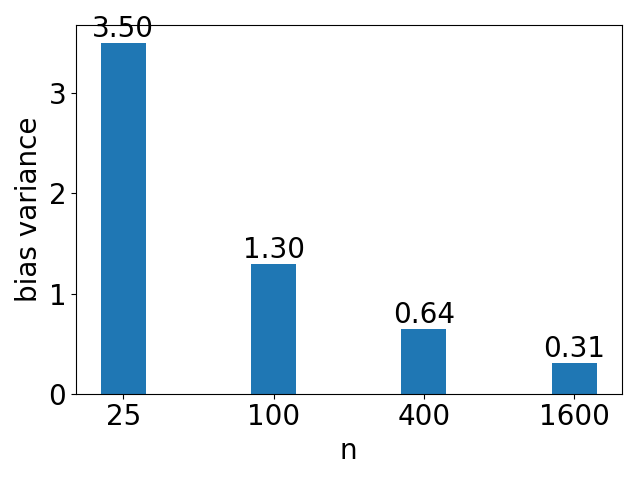

<!-- $size: A4 -->
<!-- page_number: true -->
<!-- footer: ブートストラップ情報量基準 -->

ブートストラップ情報量基準
=
情報量基準をモンテカルロ法で数値計算
* 長所
  * 真の分布についての解析的な条件が不要
  * パラメータ推定も数値計算で解を求めることができればよい
* 短所
  * モンテカルロ近似誤差が生じる
  * モンテカルロ反復のため計算時間がかかる

---
復習
=
* モデル推定


---
復習
=
* ***KL情報量*** （小さいほど、モデル$f$が真の分布$g$に近い）
  $$ I(g;f) = E_G\left[ \log{g(x)\over f(x)} \right]
            = \int \log{g(x)\over f(x)} dG $$
  * $dG$：$g$で決まる確率分布を細切れにしたもの$(\int dG=1)$
  * 連続モデルの場合
    * $g,f$：確率密度関数
    * $G$：$g$の累積分布関数
      * $G(x)=\int_{-\infty}^x g(z)dz$ つまり $dG/dx=g(x)$
    $$\rightarrow I(g;f) = \int_{-\infty}^\infty \left( \log{g(x)\over f(x)} \right) g(x)dx$$

---
復習
=
変形していくと
$$ \begin{aligned} I(g;f)
   &= \int \log{g(x)\over f(x)} dG \\
   &= \int \log g(x)dG - \int \log f(x)dG \\
   &= \mathrm{const.} - \int \log f(x)dG
   \end{aligned} $$
* 第1項：平均情報量（エントロピー）
  * 真の分布$G$のみに依存する定数
* 第2項：***平均対数尤度***

---
復習
=
ところで
* $f$：パラメータ$\theta$をもつパラメトリックモデル
* いま、$\theta$は、$G$から取得したデータ$\mathbf{x}_n=(x_1, \ldots, x_n)$にもとづいて、
  最尤推定などで求まる具体的な値$\hat\theta$であるとする
  $$ \mathrm{const.} - \int \log f(x|\hat\theta)dG $$
→$f,\hat \theta$のあてはまりの良さ
* この式（の第2項）を評価したいが、真の分布$G$は未知

---
復習
=
そこで、$G$→データにもとづく経験分布$\hat G$に置き換え
* $\hat G$：データ$x_1, \ldots, x_n$が等確率$1/n$で発生
$$ \mathrm{const.} - \int \log f(x|\hat\theta)d\hat G
   = \mathrm{const.} - {1\over n} \sum_{\alpha=1}^n \log f(x_\alpha|\hat\theta) $$
* 第2項：データにもとづく ***対数尤度*** の$1/n$
* 平均対数尤度→対数尤度に置き換え、とも言える

対数尤度に置き換えの結果、KL情報量に対して誤差が生じる
* 誤差（バイアス）を評価し、補正したい

---
復習
=
* バイアス＝置き換え前のKL情報量 − 置き換え後の式
  $$ \left( \mathrm{const.} - \int \log f(x|\hat\theta)dG \right) -
     \left( \mathrm{const.} - {1\over n} \sum_{\alpha=1}^n \log f(x_\alpha|\hat\theta) \right) $$
  $$ = {1\over n} \left[
     \sum_{\alpha=1}^n \log f(x_\alpha|\hat\theta) - n\int \log f(x|\hat\theta)dG
     \right] $$
* 期待値による評価
  * データ$\mathbf{x}_n=(x_1, \ldots, x_n)$を、確率変数$\mathbf{X}_n=(X_1, \ldots, X_n)$の実現値と考えて、確率分布$G$に対して平均をとる
    * ※$\hat\theta$も$\mathbf{x}_n$にもとづいて求まる値→平均にわたって変化

---
復習
=
バイアスの期待値評価
$$ {1\over n} E_{G(\mathbf{X}_n)} \left[
   \sum_{\alpha=1}^n \log f(X_\alpha|\hat\theta(\mathbf{X}_n))
   - n\int \log f(x|\hat\theta(\mathbf{X}_n))dG
   \right] $$
$$ = {1\over n} E_{G(\mathbf{X}_n)} \left[
   \log f(\mathbf{X}_n|\hat\theta(\mathbf{X}_n))
   - n\int \log f(x|\hat\theta(\mathbf{X}_n))dG
   \right] $$
$$ \equiv {1\over n} b(G)$$
* 真の分布$G$は未知

以降、$b(G)$を単に ***バイアス*** と呼ぶ

---
復習
=
KL情報量に戻って
* 対数尤度で置き換えたKL情報量に${1\over n} b(G)$を足して補正したもの
$$ \mathrm{const.} - {1\over n} \sum_{\alpha=1}^n \log f(x_\alpha|\hat\theta) + {1\over n} b(G)$$
$$ = \mathrm{const.} + {1\over 2n} \left(
   -2 \sum_{\alpha=1}^n \log f(x_\alpha|\hat\theta) + 2b(G) \right)$$
* 第2項大カッコ内：***情報量基準の一般形***
  * 真の分布$G$は未知
    * 様々な手法で$b(G)$を評価→様々な情報量基準

---
復習まとめ
=
* 分布$G$から得たデータ$x_1, \ldots, x_n$でモデル$f$のパラメータ$\hat\theta$を推定
* $G$に対する$f, \hat\theta$ のあてはまりの良さ：
  $$ -2 \sum_{\alpha=1}^n \log f(x_\alpha|\hat\theta) + 2b(G) $$
  * ここで
  $$ b(G) = E_{G(\mathbf{X}_n)} \left[
     \log f(\mathbf{X}_n|\hat\theta(\mathbf{X}_n))
     - n\int \log f(x|\hat\theta(\mathbf{X}_n))dG
     \right] $$
  * ただし真の分布$G$は未知

---
ブートストラップ情報量基準
=
$b(G)$をブートストラップ法によるモンテカルロシミュレーションで評価
* ブートストラップ法
  1. 未知の$G$→データ$\mathbf{x}_n$にもとづく経験分布$\hat G$ で置き換え
     * $\hat G$：データ$x_1, \ldots, x_n$が等確率$1/n$で発生
  1. $\hat G$からの無作為標本による ***ブートストラップ標本*** を定義
     * 確率変数$\mathbf{X}_n^*=(X_1^*, \ldots, X_n^*)$
  1. ブートストラップ標本データを$B$回反復抽出
     * $\{\mathbf{x}_n^{*(i)}=(x_1^{*(i)}, \ldots, x_n^{*(i)}); i=1, \ldots, B\}$
     * $\hat G$での ***ブートストラップ推定値*** の算出
       * $b(\hat G)$のうち、特に$E_{\hat G(\mathbf{X}_n)}$：$B$本の$\mathbf{x}_n^{*(i)}$による平均 

---
ブートストラップ情報量基準
=
* ブートストラップ法


---
ブートストラップ情報量基準
=
バイアス
$$ b(G) = E_{G(\mathbf{X}_n)} \left[
   \log f(\mathbf{X}_n|\hat\theta(\mathbf{X}_n))
   - n\int \log f(x|\hat\theta(\mathbf{X}_n))dG
   \right] $$
* $G \rightarrow \hat G,\quad \mathbf{X}_n \rightarrow \mathbf{X}_n^*$

バイアスのブートストラップ推定値
$$ b^*(\hat G) = E_{\hat G(\mathbf{X}_n^*)} \left[
   \log f(\mathbf{X}_n^*|\hat\theta(\mathbf{X}_n^*))
   - n\int \log f(x|\hat\theta(\mathbf{X}_n^*))d\hat G
   \right] $$

---
ブートストラップ情報量基準
=
$E_{\hat G(\mathbf{X}_n^*)}$内第1項の対数尤度
$$ \begin{aligned} \log f(\mathbf{X}_n^*|\hat\theta(\mathbf{X}_n^*))
   &= \log f(X_1^*, \ldots, X_n^*|\hat\theta(\mathbf{X}_n^*)) \\
   &= \log \prod_{\alpha=1}^n f(X_\alpha^*|\hat\theta(\mathbf{X}_n^*)) \\
   &= \sum_{\alpha=1}^n \log f(X_\alpha^*|\hat\theta(\mathbf{X}_n^*)) \\
   &\equiv \ell(\mathbf{X}_n^*|\hat\theta(\mathbf{X}_n^*))
   \end{aligned} $$

---
ブートストラップ情報量基準
=
$E_{\hat G(\mathbf{X}_n^*)}$内第2項の平均対数尤度の$n$倍
$$ \begin{aligned} n\int \log f(x|\hat\theta(\mathbf{X}_n^*))d\hat G
   &= n\cdot {1\over n} \sum_{\alpha=1}^n \log f(x_\alpha|\hat\theta(\mathbf{X}_n^*)) \\
   &= \sum_{\alpha=1}^n \log f(x_\alpha|\hat\theta(\mathbf{X}_n^*)) \\
   &\equiv \ell(\mathbf{x}_n|\hat\theta(\mathbf{X}_n^*))
   \end{aligned} $$
よって
$$ b^*(\hat G) = E_{\hat G(\mathbf{X}_n^*)} \left[
   \ell(\mathbf{X}_n^*|\hat\theta(\mathbf{X}_n^*))
   - \ell(\mathbf{x}_n|\hat\theta(\mathbf{X}_n^*))
   \right] $$

---
ブートストラップ情報量基準
=
$E_{\hat G(\mathbf{X}_n^*)}$：$B$本の$\mathbf{x}_n^{*(i)}$による平均 で近似
$$ \begin{aligned} b^*(\hat G)
   &\approx {1\over B}\sum_{i=1}^B \left[
            \ell(\mathbf{x}_n^{*(i)}|\hat\theta(\mathbf{x}_n^{*(i)}))
            - \ell(\mathbf{x}_n|\hat\theta(\mathbf{x}_n^{*(i)})) \right] \\
   &\equiv {1\over B}\sum_{i=1}^B D^{*(i)} \equiv b_B(\hat G)
   \end{aligned} $$

***ブートストラップ情報量基準EIC***
$$ 2\left( -\ell(\mathbf{x}_n|\hat\theta(\mathbf{x}_n)) + b_B(\hat G) \right) $$

---
例1：ブートストラップ近似誤差
=
* 真の分布$G$：標準正規分布$N(0, 1)$
* モデル$f$：正規分布$N(\mu, \sigma^2)$
  * 最尤法にてパラメータ推定
* ブートストラップシミュレーション
  * $B=100$
  * $n=25, 100, 400, 1600$
    * 各$n$ごとに試行回数 $T=10000$
      * $b_B(G)$の、試行平均／分散
      * $D^{*(i)}$の分散の、試行平均
        * ※$D^{*(i)}$の平均が$b_B(G)$
      * 対数尤度の、試行平均

---
例1：ブートストラップ近似誤差
=
``` eic_ex1.py ```
 
 

---
例1：ブートストラップ近似誤差
=
* 真のバイアス値は2.27, 2.06, 2.02, 2.00
* 分散：$n$とともに増大
  * $n$が大きい場合、ひとつひとつの試行の推定値は精度が悪い
* 2種類の分散が同じ傾向で増加している
  * ブートストラップ標本に対する$D^{*(i)}$の分散が原因

---
分散減少法
=
$D^{*(i)}$の分散を減らすテクニック
* $b(G) = E_{G(\mathbf{X}_n)} \left[ D(\mathbf{X}_n;G) \right]$ とおく
  $$ D(\mathbf{X}_n;G) \equiv \log f(\mathbf{X}_n|\hat\theta(\mathbf{X}_n))
                           - n\int \log f(x|\hat\theta(\mathbf{X}_n))dG $$
* $D=D_1+D_2+D_3$ と分解
  * $D_1 = \log f(\mathbf{X}_n|\hat\theta(\mathbf{X}_n)) - \log f(\mathbf{X}_n|\theta)$
  * $D_2 = \log f(\mathbf{X}_n|\theta) - n\int \log f(x|\theta)dG$
  * $D_3 = n\int \log f(x|\theta)dG - n\int \log f(x|\hat\theta(\mathbf{X}_n))dG$

  ※$\theta$は真の分布$G$について最尤のパラメータ

---
分散減少法
=
ここで $E_{G(\mathbf{X}_n)} \left[ D_2(\mathbf{X}_n;G) \right]$
$$ = E_{G(\mathbf{X}_n)} \left[ \log f(\mathbf{X}_n|\theta) \right] 
   -n E_{G(\mathbf{X}_n)} \left[ \int \log f(x|\theta)dG \right] $$
$$ = E_{G(\mathbf{X}_n)} \left[ \sum_{\alpha=1}^n \log f(X_\alpha|\theta) \right] 
   -n \int \log f(x|\theta)dG $$
$$ = \sum_{\alpha=1}^n E_{G(X_\alpha)} \left[ \log f(X_\alpha|\theta) \right] 
   -n \int \log f(x|\theta)dG $$
$$ = n E_{G(x)} \left[ \log f(x|\theta) \right] 
   -n \int \log f(x|\theta)dG = 0$$

---
分散減少法
=
したがって $b(G) = E_{G(\mathbf{X}_n)} \left[ D_1(\mathbf{X}_n;G) + D_3(\mathbf{X}_n;G) \right]$ より
$$ b_B(\hat G) = {1\over B}\sum_{i=1}^B \left[ D_1^{*(i)} + D_3^{*(i)} \right] $$
※$D_1,D_3$内の$\theta$は、$\hat G$について最尤（つまりデータ$\mathbf{x}_n$について最尤）のパラメータに置き換わる

* 以下が示されており、ブートストラップ標本に対する分散を減少させることができる
  * $D_1,D_3$の分散：$O(1)$
  * $D_2$の分散：$O(n)$

---
例2-1：例1と同じ条件で分散減少法を使用
=
``` eic_ex2-2.py ```
  

---
例2-2：例1と同じ条件で分散減少法を使用、真の分布がラプラス分布の場合
=
``` eic_ex2-2.py ```
 

* 真のバイアス値は3.87, 3.57, 3.56, ?(n=1600)
  * AICのバイアス値2より近い値になっている

---
例2-3：例1と同じ条件で分散減少法を使用、パラメータ推定がメジアン推定量の場合
=
メジアン推定量
* $\mu\rightarrow\hat\mu_m=\mathrm{median}_i\{X_i\}$
* $\sigma\rightarrow\hat\sigma_m=c^{-1}\mathrm{median}_i\{|X_i-\hat\mu_m|\}$
  * $c=\Phi^{-1}(0.75)$
    * $\Phi$：$N(0, 1)$の累積分布関数

---
例2-3：例1と同じ条件で分散減少法を使用、パラメータ推定がメジアン推定量の場合
=
``` eic_ex2-2.py ```
 

* 真のバイアス値は2.58, 2.12, 2.02, ?(n=1600)

---
Excuse
=
* 例3、例4の結果はテキストの値と異なっていますが原因が追求しきれていません
  * 例3：$k>1$だと$\sigma=0$となる特異的な状況が発生しやすいため、$\sigma<0.1$とならないようアドホックに回避しています
  * 例4：$x$の分布が不明なので、$N(0, 1)$としています
* p.138の2段階ブートストラップは再現／導出できませんでした